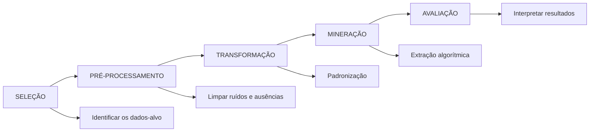

PROCESSO KDD - KNOWLEDGE DISCOVERY IN DATABASE:

- A mineração não funciona sozinha 
- 80% do tempo do projeto nas etapas anteriores

|           | TAREFAS PREDITIVAS                             | TAREFAS DESCRITIVAS                                                                                            |
| --------- | ---------------------------------------------- | -------------------------------------------------------------------------------------------------------------- |
| OBJETIVO: | Estimar ou prever valor futuro ou desconhecido | Encontrar estruturas, grupos ou  anomalias ocultas nos seus dados                                           |
| MECÂNICA: | Utilizar histórico de dados já conhecidos      | Exploratória, vai percorrer os seus dados sem rótulos previstos e busca entender  o que existe naturalmente |
| EXEMPLO:  | Se um email é spam ou não                      | Agrupar perfis de consumo que não são conhecidos pela empresa                                                  |

**DIAGNÓSTICOS DA TAREFA PREDITIVA**

|                                                                                                                                             | PERGUNTA                                  | SAÍDA                             | EXEMPLO DE NEGÓCIO                                                                                               |
| ------------------------------------------------------------------------------------------------------------------------------------------- | ----------------------------------------- | --------------------------------- | ---------------------------------------------------------------------------------------------------------------- |
| CLASSIFICAÇÃO                                                                                                                               | Qual categoria o registro pertence?       | Rótulo (idade, peso, altura, etc) | Diagnósticos médicos (doente/saudável) Transação bancária(legítima/ilegítima)                                 |
| REGRESSÃO (ESTIMAÇÃO)  Para estimar algo, deve se regredir no histórico de seus  dados para poder realizar uma previ- são | Qual valor devo associar á este registro? | Contínua ou números               | Análise médica: Qual a data de alta do paciente internado  Análise financeira: Qual o valor da ação amanhã |
**DIAGNÓSTICOS DA TAREFA DESCRITIVA**

|                          | PERGUNTA                                         | EXEMPLO                                                                                                                                                                                                                                                                         |
| ------------------------ | ------------------------------------------------ | ------------------------------------------------------------------------------------------------------------------------------------------------------------------------------------------------------------------------------------------------------------------------------- |
| AGRUPAMENTO (CLUSTER) | Quais grupos naturais existem nos dados obtidos? | - Segmentação de mercado baseado no comportamento (sem definir perfis antes)  "Eu tenho um monte de animais e eu quero agrupar por espécie, por exemplo, grupo dos felinos (gato, onça...)" Ou seja, procurar dentro dos dados quais pertencem a um determinado grupo. |
| ASSOCIAÇÃO               | Quais itens ocorrem juntos?                      | - Pessoas que assistem o filme X tente a ler o livro Y "ao comprar um tenis, o site ja te oferece a meia" Pra isso se usa um algoritmo **==APRIORI==**, que vai fazer essa análise de probabilidade da compra de algo junto                                               |
| DETECÇÃO DE ANOMALIAS    | Quais registros fogem do padrão?                 | - Aumento de consumo de energia repentino                                                                                                                                                                                                                                       |

-----
CENÁRIO DE SAÚDE
Problema:
- Um hospital possui um histórico de paciente e quer prever no momento da admissão, quantos dias o paciente novo ficará internado.
- Qual técnica aplicar?
- Resposta: Técnica de Regressão 
---
CENÁRIO DE VAREJO
Problema:
- Loja online analisa carrinhos de compra e quer que o algoritmo recomende produtos de acordo com o que o usuário colocou no carrinho
- Qual técnica aplicar?
- Resposta: Técnica de Associação através de um algoritmo Apriori
---
==Mineração de dados x Banco de dados==
Enquanto um guarda os dados, outro os explora. 

----
==Quantos mais dados, melhor para uma mineração?==
Não importa a quantidade dos dados mas sim a qualidade deles, pois se entrar lixo sai lixo.

----
==O Agrupamento nao requer dados rotulados?==
O agrupamento não querer dados rotulados pois ele pode ser feito através das características naturais