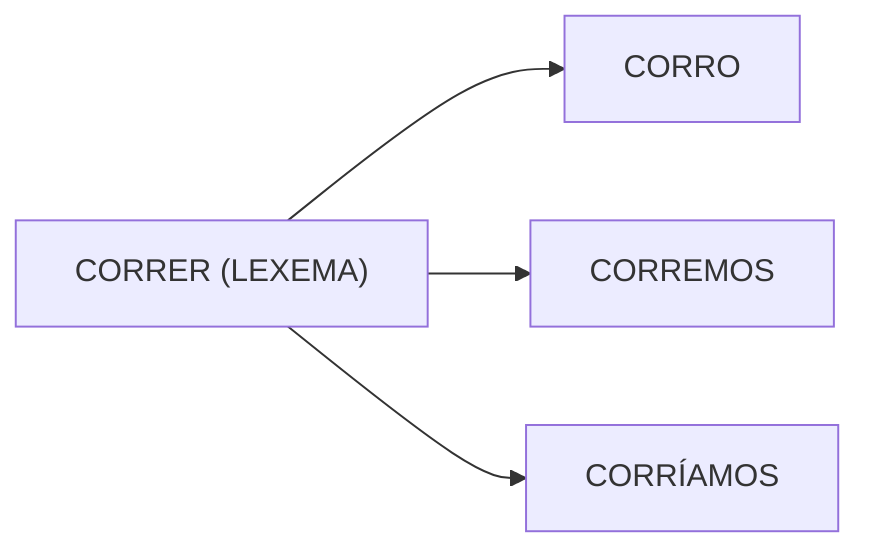
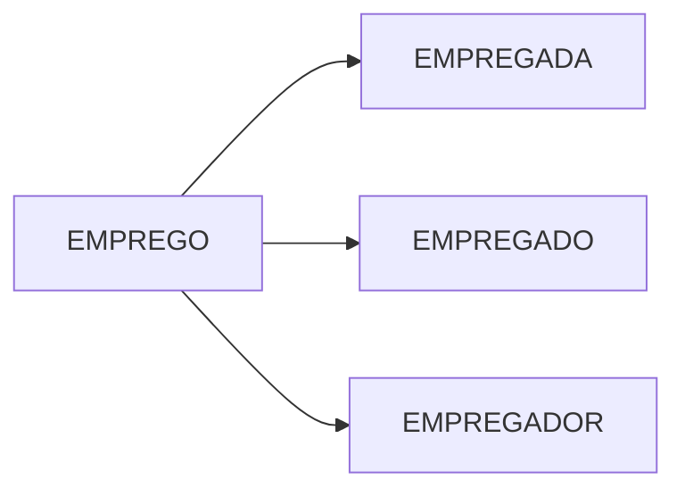
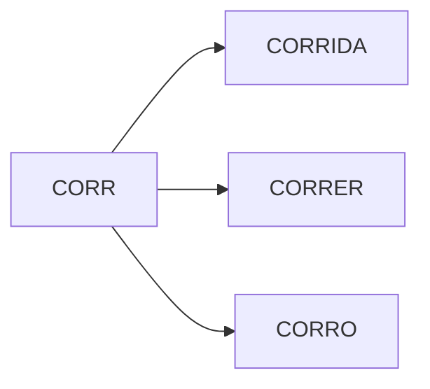

### Técnicas de pré-processamento de texto
↪︎ Permitem com que o texto possa ser preparado para ser preparado para ser utilizado pelos algoritmos de Aprendizagem de máquina
 ##### 1- Expressões regulares
↪︎ São utilizadas para a manipulação de sequências de caracteres, como por exemplo, na validação de campos que possuem um padrão pré-definido.
 ##### 2- Tokenização
↪︎ Permite dividir o texto em unidades menores, por exemplo: em palavras ou em sentenças.

==Exemplo original:== O menino foi para a escola de ônibus.
 ↪︎ por palavra
 ==Exemplo tokenizado:== |O| |menino| |foi| |para| |a| |escola| |de| |ônibus|
##### 3- Classificação por palavras
↪︎ Lexema: reúne todas as flexões de uma palavra.

↪︎ Lema: termo que pode representar o formato da palavra no dicionário

↪︎ Raiz: é o prefixo comum entre um grupo de palavras.

##### 4- Lematização
↪︎ É o processo de extrair o lema de uma palavra
==Exemplo original:== Os gatos estão caçando os ratos
     ⬇︎
==Exemplo pós lematização:== O gato estar caçar o rato

##### 5- Radicalização
↪︎ É o processo de extrair o radical de uma palavra
==Exemplo original:== O menino foi para a escola de ônibus.
       ⬇︎
==Exemplo pós lematização:== **O** menino **foi para a escola de ônibus**.

> **Professora**
> O lexema permite a compreensão de todas as formas que uma palavra pode apresentar contendo o mesmo significado.

continuacao em : [[pln aula 4 - 2608]]
